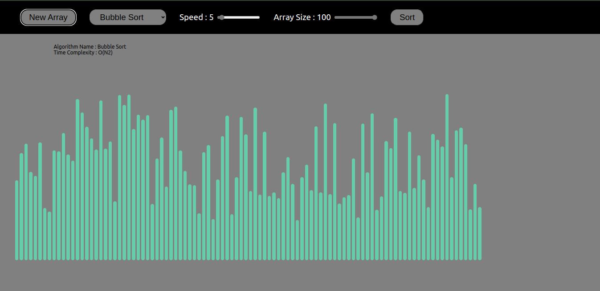

# Sorting Visyalizer
## This project build with implementation of basic sorting algorithm like
1. Bubble Sort
2. Selection Sort
3. Merge Sort
4. Insertion Sort

## This project has some key features ex.
1. Adjustable array size from 10 to 100 values
2. Animation Speed can be changed as per needed

## Some ScreenShot of Project

## Guide to Run this Project
1. You need to have Node.JS, NPM, React Installed on your system.
2. Import the project with 'Git clone' or download the zip file. 
3. Run the project with 'npm start' command
